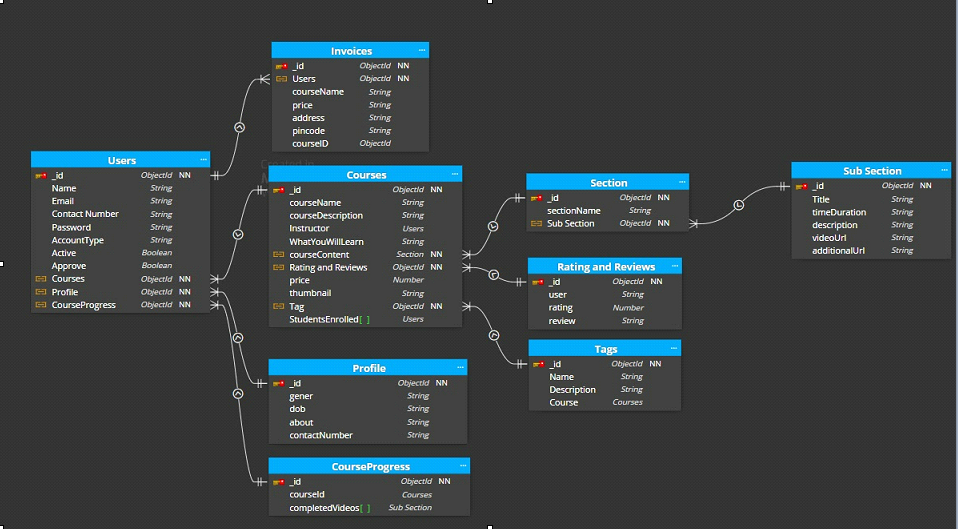

<small>

## 📚 LMS Database Schema (MongoDB)

This document provides a complete overview of the MongoDB collections used in the Learning Management System (LMS). It includes details about each collection, fields, data types, and relationships.

---

## 🧍 USERS & 🪪 PROFILE

<table>
<tr>
<td>

### USERS

| Field           | Type      | Description                         |
|----------------|-----------|-------------------------------------|
| `_id`          | ObjectId  | Unique user ID                      |
| `name`         | String    | Full name of the user               |
| `email`        | String    | Email address                       |
| `contactNumber`| String    | Mobile number                       |
| `password`     | String    | Hashed password                     |
| `accountType`  | String    | 'Admin', 'Instructor', or 'Student' |
| `active`       | Boolean   | User account status                 |
| `approve`      | Boolean   | Admin approval status               |
| `courses`      | ObjectId  | Courses created/enrolled            |
| `profile`      | ObjectId  | Linked profile                      |
| `courseProgress` | ObjectId | Linked course progress              |

</td>
<td>

### PROFILE

| Field           | Type     | Description        |
|----------------|----------|--------------------|
| `_id`          | ObjectId | Profile ID         |
| `gender`       | String   | Gender             |
| `dob`          | String   | Date of birth      |
| `about`        | String   | Bio/about section  |
| `contactNumber`| String   | Contact number     |

</td>
</tr>
</table>

---

## 🎓 COURSES & 📦 SECTION

<table>
<tr>
<td>

### COURSES

| Field               | Type        | Description                      |
|--------------------|-------------|----------------------------------|
| `_id`              | ObjectId    | Course ID                        |
| `courseName`       | String      | Course title                     |
| `courseDescription`| String      | Description                      |
| `instructor`       | ObjectId[]     | ID of the linked instructor        |
| `whatYouWillLearn` | String      | Learning outcomes                |
| `courseContent`    | ObjectId[]  | Linked sections                  |
| `ratingAndReviews` | ObjectId[]  | Ratings & reviews                |
| `price`            | Number      | Price                            |
| `thumbnail`        | String      | Course image URL                 |
| `tag`              | ObjectId[]  | Tags                             |
| `studentsEnrolled` | ObjectId[]  | Enrolled student IDs             |

</td>
<td>

### SECTION

| Field        | Type       | Description           |
|-------------|------------|-----------------------|
| `_id`       | ObjectId   | Section ID            |
| `sectionName`| String    | Section name          |
| `subSection`| ObjectId[] | Linked subsections    |

</td>
</tr>
</table>

---

## 🧩 SUBSECTION & ⭐ RATING AND REVIEWS

<table>
<tr>
<td>

### SUBSECTION

| Field           | Type     | Description                 |
|----------------|----------|-----------------------------|
| `_id`          | ObjectId | Subsection ID               |
| `title`        | String   | Lesson title                |
| `timeDuration` | String   | Video duration              |
| `description`  | String   | Lesson description          |
| `videoUrl`     | String   | Video URL                   |
| `additionalUrl`| String   | Supporting material URL     |

</td>
<td>

### RATING AND REVIEWS

| Field   | Type     | Description             |
|--------|----------|-------------------------|
| `_id`  | ObjectId | Review ID               |
| `user` | String   | Reviewer name/ID        |
| `rating`| Number  | Rating (1 to 5)         |
| `review`| String  | Review comment          |

</td>
</tr>
</table>

---

## 🏷️ TAGS & 📈 COURSE PROGRESS

<table>
<tr>
<td>

### TAGS

| Field        | Type     | Description          |
|-------------|----------|----------------------|
| `_id`       | ObjectId | Tag ID               |
| `name`      | String   | Tag name             |
| `description`| String  | Tag description      |
| `course`    | ObjectId | Linked course ID     |

</td>
<td>

### COURSE PROGRESS

| Field            | Type       | Description              |
|------------------|------------|--------------------------|
| `_id`            | ObjectId   | Progress ID              |
| `courseId`       | ObjectId   | Linked course ID         |
| `completedVideos`| ObjectId[] | Completed video IDs      |

</td>
</tr>
</table>

---

## 💳 INVOICES

| Field        | Type     | Description                  |
|-------------|----------|------------------------------|
| `_id`       | ObjectId | Invoice ID                   |
| `users`     | ObjectId | Linked user ID               |
| `courseName`| String   | Purchased course name        |
| `price`     | String   | Paid amount                  |
| `address`   | String   | Billing address              |
| `pincode`   | String   | Postal code                  |
| `courseID`  | ObjectId | Linked course ID             |

---

## 🔗 RELATIONSHIPS SUMMARY

| Relationship                | Type         | Description                              |
|----------------------------|--------------|------------------------------------------|
| Users ↔ Profile             | One-to-One   | User has a single profile                |
| Users ↔ CourseProgress      | One-to-One   | User has one course progress document    |
| Users ↔ Courses             | Many-to-Many | Users can enroll in multiple courses     |
| Users ↔ Invoices            | One-to-Many  | A user can have multiple invoices        |
| Courses ↔ Sections          | One-to-Many  | Course has multiple sections             |
| Sections ↔ SubSections      | One-to-Many  | Section has multiple subsections         |
| Courses ↔ RatingAndReviews  | One-to-Many  | Course can have multiple reviews         |
| Courses ↔ Tags              | Many-to-Many | Courses can have multiple tags           |

---

> ✅ Designed for flexibility, scalability, and clean data access using MongoDB & Mongoose.

</small>